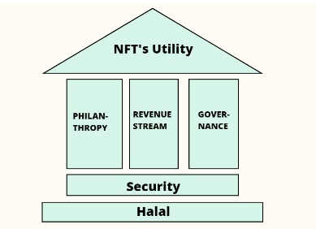

# About The Project

## 1. What is Halalan NFT

Halalan NFT is an ecosystem that will brings halal aspect as foundation perspective toward the NFTs collection and DeFi protocol that will build in ecosystem. Halalan NFT is not just a collection of NFTs that we may see in the market at the moment, which most of them have no utility at all and only take advantage of the temporary hype. Meanwhile, Halalan NFT is a long-term NFT project that will benefit the holder beyond just looking at the NFT they has purchased

## 2. What makes us different?

We focus on 6 things that will be long-term fundamentals of this project, we call it : House of Halalan Strategy. We believe that the web3 industry has enormous potential in the future, unfortunately many of the web3 projects ignore the utility aspect of the token or NFT created. Halalan NFT will build a halal ecosystem that focuses on providing ultimate NFT utilities so that it has real benefits for its holders.

Halal (permissible according to Islamic Perspective) and security aspects are the foundation of the development and operation of Halalan NFT ecosystem. And to achieve the ultimate NFT utility, it needs 3 pillars to achieve it, namely revenue stream, governance, and philanthropy.

